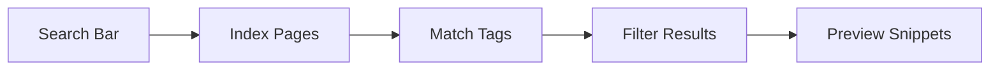

## Overview

Glitch provides powerful tools to create, organize, and collaborate on your project documentation. You can build rich MDX pages with components, manage content with folders and tags, edit in real-time with teams, and find information quickly through advanced search.

<Columns cols={3}>
  <Card title="Creation & Editing" icon="edit-3" href="#document-creation">
    Build pages with visual editors and MDX syntax.
  </Card>
  <Card title="Organization" icon="folder" href="#organization">
    Structure content using folders and tags.
  </Card>
  <Card title="Collaboration" icon="users" href="#collaboration">
    Work together with real-time editing.
  </Card>
</Columns>

## Document Creation and Editing Tools

Start new documents from templates or blank pages. The visual editor supports drag-and-drop components, while the code view lets you write raw MDX.

<Steps>
  <Step title="Create a New Page" icon="plus">
    Navigate to your workspace and click `New Page`. Choose a template like "API Reference" or start blank.
  </Step>
  <Step title="Add Components" icon="components">
    Use the sidebar to insert `<Callout>`, `<Tabs>`, or other elements. Preview changes live.
  </Step>
  <Step title="Publish" icon="upload">
    Save and publish. Changes go live instantly.
  </Step>
</Steps>

Here is a basic MDX example you can copy into your page:

<CodeGroup tabs="MDX,JSX">
```mdx
<Callout kind="info">
  This is a sample callout.
</Callout>

## Quick Start

```javascript
console.log("Hello, Glitch!");
```
```
```jsx
<Callout kind="info">
  This is a sample callout.
</Callout>

## Quick Start

const greeting = "Hello, Glitch!";
console.log(greeting);
```
</CodeGroup>

<Callout kind="tip">
  Use `{frontmatter}` at the top of every page for metadata like `title` and `description`.
</Callout>

## Organization with Folders and Tags

Keep your docs structured. Create folders for sections like "Guides" or "API". Add tags such as `feature` or `guide` for easy categorization.

| Feature       | Description                          | Example Tags          |
|---------------|--------------------------------------|-----------------------|
| Folders       | Nested organization                 | `/guides/quickstart` |
| Tags          | Cross-reference content             | `["api", "feature"]` |
| Searchable    | Filter by multiple tags             | `guide + beginner`   |

Assign tags in the page editor:

````mdx
---
title: My Guide
tags: ["guide", "beginner"]
---
````

## Collaboration and Real-Time Editing

Invite team members to edit simultaneously. Changes appear live, with cursor indicators and version history.

<Tabs>
  <Tab title="Invite Collaborators" icon="user-plus">
    Share your workspace URL or add emails in settings. Collaborators see a `Join` button.
  </Tab>
  <Tab title="Real-Time Edits" icon="edit-3">
    Multiple cursors show who edits what. Use `@mentions` for comments: `@team review this section`.
  </Tab>
  <Tab title="Version History" icon="git-branch">
    Revert changes or compare versions from the history panel.
  </Tab>
</Tabs>

<Callout kind="success">
  Real-time sync works across devices with `<100ms` latency.
</Callout>

## Search and Filtering Capabilities

Glitch's search indexes all pages, tags, and content. Filter by tags, folders, or keywords.

<ExpandableGroup>
  <Expandable title="Advanced Search Syntax" default-open="true">
    Use operators like `tag:api` or `folder:guides title:quickstart`.
  </Expandable>
  <Expandable title="Saved Filters">
    Pin frequent searches like "all `bugfix` updates".
  </Expandable>
</ExpandableGroup>



These features help you maintain scalable documentation efficiently. Explore [quickstart](/quickstart) next for hands-on setup.